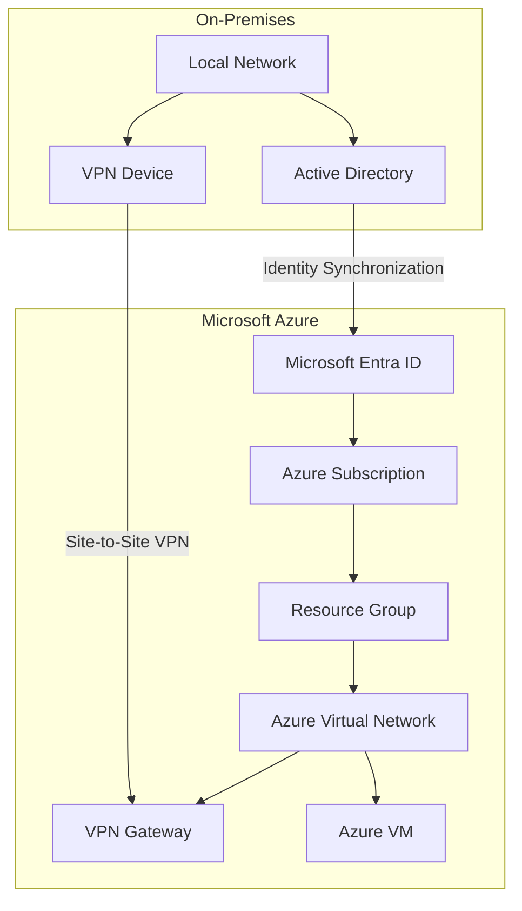

# Hybrid Identity and Connectivity in Microsoft Azure

## Overview

This project introduces the concepts of Hybrid Identity and Hybrid Connectivity in Microsoft Azure. It explains how an on-premises Active Directory can be integrated with Microsoft Entra ID, how users are synchronized, and how a Site-to-Site VPN securely connects an on-premises network with Azure resources.

---

# Task 1 – Hybrid Environment Overview

## Hybrid Identity Architecture

### Component Roles

| Component | Role |
|-----------|------|
| Local Network | Company's internal network |
| Active Directory | Stores users, groups and computers |
| Microsoft Entra ID | Cloud identity management |
| Azure Subscription | Azure resources container |
| Resource Group | Organizes Azure resources |
| Virtual Network | Azure private network |
| Azure VPN Gateway | Secure VPN endpoint |
| VPN Device | Local VPN connection |
| Azure VM | Cloud workload |

---

# Task 2 – Azure Components Inventory

| Component | Azure Portal Location | Status |
|------------|----------------------|--------|
| Microsoft Entra ID | Microsoft Entra ID | Available |
| Azure Subscription | Subscriptions | Available |
| Resource Groups | Resource Groups | Available |
| Virtual Networks | Virtual Networks | Available |
| Virtual Network Gateway | Virtual Network Gateway | Not Created |
| VPN Gateway | Virtual Network Gateway | Not Created |

### Example Environment

| Item | Value |
|------|-------|
| Tenant | Your Microsoft Entra Tenant |
| Subscription | Azure for Students |
| Region | West Europe |

---

# Task 3 – Identity Synchronization Design

| OU / Object | Synchronize | Reason |
|-------------|-------------|--------|
| Sales | Yes | Employees need Microsoft 365 |
| IT | Yes | Administrators require Azure access |
| External | No | Temporary external users |
| Service Accounts | No | Security reasons |
| Devices | Yes | Device management |

### Objects synchronized

- Users
- Security Groups
- Devices

### Synchronization Technology

Microsoft Entra Connect Sync synchronizes objects from the on-premises Active Directory to Microsoft Entra ID.

---

# Task 4 – User Sign-in Workflow

| Step | Location |
|------|----------|
| 1. Create user Mia Müller in Active Directory | On-Premises |
| 2. Microsoft Entra Connect detects changes | On-Premises |
| 3. User is synchronized | Between On-Premises and Azure |
| 4. User appears in Microsoft Entra ID | Azure |
| 5. User opens Microsoft 365 | Azure |
| 6. Authentication is performed | Microsoft Entra ID |
| 7. User gains access | Azure Cloud |

### Verification Points

- Verify that Mia Müller appears in Microsoft Entra ID.
- Verify that the user can successfully sign in to Microsoft 365.

---

# Task 5 – Site-to-Site VPN Design

| Setting | Value |
|----------|-------|
| Resource Group | rg-hybrid |
| Region | West Europe |
| Virtual Network | vnet-hybrid |
| Azure Address Space | 10.20.0.0/16 |
| Workload Subnet | 10.20.1.0/24 |
| GatewaySubnet | 10.20.255.0/27 |
| Local Network | 192.168.10.0/24 |
| VPN Gateway | vpngw-hybrid |
| Local Network Gateway | lng-hybrid |
| Connection Name | conn-onprem-azure |
| Shared Key | ******** |
| Public IP | To be provided by on-premises VPN device |

---

# References

- Microsoft Learn – Microsoft Entra ID
- Microsoft Learn – Microsoft Entra Connect Sync
- Microsoft Learn – Azure VPN Gateway
- Microsoft Learn – Azure Virtual Network
- Microsoft Learn – Azure Site-to-Site VPN
- Microsoft Learn – Azure Architecture Center
